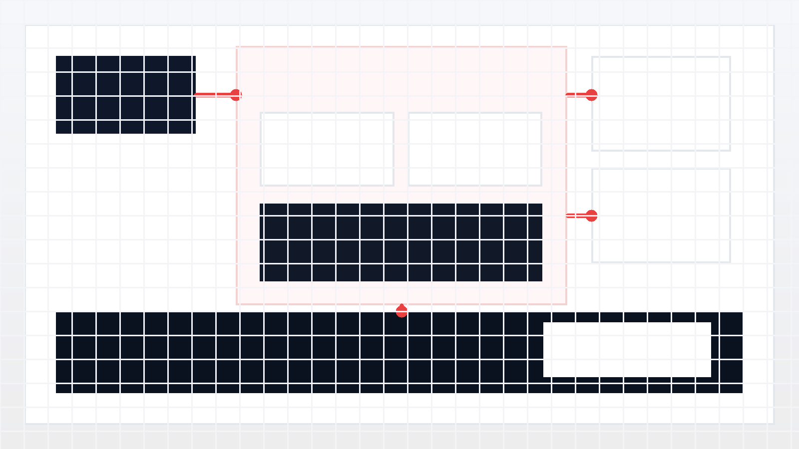

# Agent Passport

> Trust by signature, not by CAPTCHA.

Agent Passport is a Web3 platform for giving AI agents verifiable identity, their own wallets, and tamper-proof audit trails. A user creates an agent in a simple web app, the platform provisions and funds that agent on Avalanche Fuji, and every important action can be verified independently on-chain.

## Try It Live

[Preview URL placeholder](https://your-vercel-preview.vercel.app)

## Quick Links

- [Documentation hub](./docs/README.md)
- [Vision](./docs/00-vision.md)
- [Architecture](./docs/01-architecture.md)
- [API contracts](./docs/03-api-contracts.md)
- [Environment setup](./docs/05-environment-setup.md)
- [Demo script](./docs/07-demo-script.md)

## What It Does

Agent Passport gives each AI agent a real unit of accountability. Instead of hiding behind shared API keys or human browser sessions, an agent gets its own wallet, its own on-chain passport, and its own audit trail. That lets websites verify whether an agent is trusted, lets users inspect what happened, and gives judges a concrete Snowtrace trail for the demo.

## Built With

- Next.js 14, React 18, Tailwind CSS
- Thirdweb for sign-in and embedded wallets
- Avalanche Fuji, Solidity, and Foundry
- Supabase for persistence
- Anthropic Claude via the Vercel AI SDK
- Firecrawl and Jina for web retrieval
- Vercel for previews and deployment

## Repo Layout

```text
agent-passport/
├── apps/
│   └── web/              # Next.js app (marketing, app shell, API routes)
├── packages/
│   └── contracts/        # Solidity contracts and deployment scripts
└── docs/                 # Vision, architecture, tasks, setup, and demo plan
```

## Run Locally

```bash
pnpm install
cp .env.example .env.local
pnpm dev
```

See [docs/05-environment-setup.md](./docs/05-environment-setup.md) for the full environment checklist.

## How It Works

The web app handles onboarding, agent creation, and the demo flow. Avalanche Fuji holds the trust boundary: agent passports, wallet ownership, and action receipts live on-chain so a third party can verify the claims without trusting our backend.



## Smart Contracts

Deployment links: pending final Fuji deploy

- `AgentPassport`: Snowtrace link to be added
- `ActionLog`: Snowtrace link to be added

## Team

- Person 1: Backend and contracts
- Person 2: Auth and agent wallets
- Person 3: Execution UI
- Person 4: Dashboard and agent management
- Person 5: Frontend shell, polish, and demo prep

## Hackathon

Built at Web3NZ Hackathon 2026 in a 26-hour sprint.

## License

MIT
